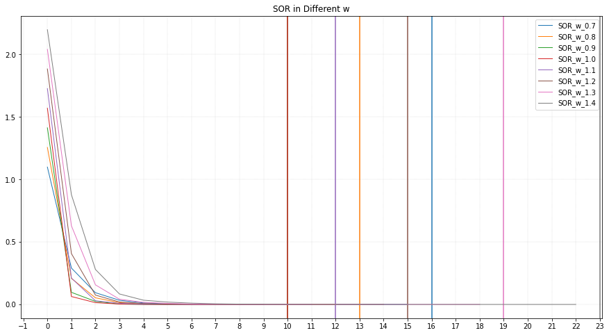

# SOR 實驗結果
使用SOR解線性方程組,其中垂直線表示找出解時需要的迭代次數 
* Infinity Norm 作為衡量標準
* w = [0.7, 0.8, 0.9,1.0,1.1,1.2,1.3,1.4]
* Size = [150,200,500]
## Matrix Size is 150
在此Size下，不同w所需要的迭代次數，如下表

|W|N_iter|
|:----:|:----:|
|0.7|16|
|0.8 |13|
|0.9|10|
|1.0 |10|
|1.1 |12|
|1.2 |15|
|1.3 |19|
|1.4 |23|

## Matrix Size is 200
在此Size下，不同w所需要的迭代次數，如下表
|W|N_iter|
|:----:|:----:|
|0.7|16|
|0.8 |13|
|0.9|10|
|1.0 |10|
|1.1 |12|
|1.2 |15|
|1.3 |19|
|1.4 |23|

## Matrix Size is 500
在此Size下，不同w所需要的迭代次數，如下表
|W|N_iter|
|:----:|:----:|
|0.7|16|
|0.8 |13|
|0.9|10|
|1.0 |10|
|1.1 |12|
|1.2 |15|
|1.3 |19|
|1.4 |23|

# Conclusion
1. 由迭代次數觀察，解答該線性方程組所需要的步數(N_iter)，和 Matrix Size 無關
2. 由迭代次數觀察，解答該線性方程組所需要的步數(N_iter)，落在0.9 和 1.0,表示這個問題適合用GS Method來解，需要的步伐數最少。
